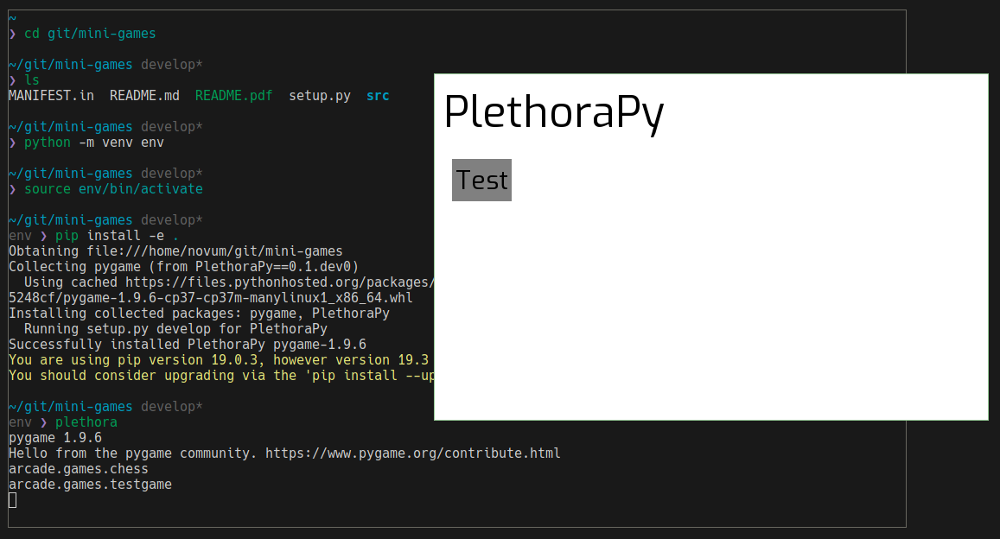

# Plethora Py


## Development


### Virtual Environment

A virtual environment in python allows developers to use different python
interpretters for a package and also manage dependencies without breaking user
or global python dependencies on the system. As a developer, you should create a
virtual environment to facilitate development.

#### Set up virtual environment

In order to set up a virtual environment, run `python3 -m venv env`. This
creates a `env/` directory that should be at the root of the project.

#### Using a virtual environment

While developing, you should make sure that you activate your virtual
environment (venv) when you:
- are using `pip`
- are using `python`

You can activate the venv by running `source env/bin/activate` in **sh/bash/zsh
shells on linux, bsd, and os x** [after setting up a
venv](#set-up-a-virtual-environment). (Fish and csh shells have different syntax
and, therefore, there are also `env/bin/activate.{fish,csh}` variants.)

You can activate the venv by running `call env/Scripts/activate.bat` on **windows** [after setting up a venv](#set-up-a-virtual-environment).

You can deactivate the venv if you want by calling `deactivate`.

### Running

Before you run Plethora Py, you need to build the package and its dependencies
as well as install a console script to run the program. `setup.py` with `pip`
makes this very easy.

First, [make sure you are in a venv](#using-a-virtual-environment).

Then, to build and install Plethora Py, use `pip install -e .`. This builds and installs Plethora Py in the venv, and it also installs the console script `plethora` that is accessible as a script in the venv. **You only need to run `pip install -e .` once as long as you use `-e`.**

Finally, to run Plethora Py, run the console script: `plethora`.


### Quickref

```sh
cd $somewhere/mini-games
python -m venv env       # only once to create venv
source env/bin/activate  # once per shell/terminal **
pip install -e .         # only once to build and install
plethora                 # run Plethora Py
```

\*\* `call env\Scripts\activate.bat` on windows




### Dependencies

If you want to add python programs for testing, feel free. Just make sure you
are in a venv and then use `pip install {pipy-pkg}`. `pytest` and `mypy` are
already being used for *unit testing* and *static type checking* (resp) for
*chess*. To install them both, use `pip install pytest mypy`, or you can install
just one.

If there is a **mandatory** dependency for a game, **be sure to add it to *setup.py* in `install_requires` list** and re-run `pip -install -e .` to rebuild.

## Plethora Py UI and API

Once `plethora` is run, it calls `plethoraAPI:main` in the arcade package. This
launches the UI and dynamically imports all games in the `src/arcade/games/`
directory that have an `__init__.py` file. For example, *chess* has
`src/arcade/games/chess/__init__.py` and all related files "next to"
`__init__.py`.

Each `__init__.py` should create a function called `insert_cartridge()` that
returns a *game* instance. Python developers often rely on duck typing to create
interfaces, however the *PlethoraAPI* class offers a `Game` class that can be
inherited. It will make your life much easier, as it handles registering the
game for you -- so long as you call `super().__init__(size=(400,400), fps=40)`,
for instance, in the games `__init__(self)`. The only other things you need to
implement then would be the `onrender(self)` and `onevent(self, event)` methods.
See [Testgame Stubs](#testgame-stubs) to get quickly set up with a new game.

### New Game Stubs

Use these steps to get set up with a new game.

1. `mkdir src/arcade/games/yourgame/`

2. Add to `insert_cartridge()` to `src/arcade/games/yourgame/__init__.py`.

For example, from `src/arcade/games/testgame/__init__.py`:

```python
from arcade.games.testgame import testgame

def insert_cartridge():
    return testgame.Game()
```

3. Create `src/arcade/games/yourgame/yourgame.py`

This could (should?) import `arcade.plethoraAPI` and extend
`arcade.plethoraAPI.Game` to create a new game. It can import anything from
`arcade` or from the current directory (`arcade.games.yourgame`)

See `src/arcade/games/testgame/testgame.py` for the full code.

## Todo

1. Finish Game 1
2. Integrate games with UI on develop
3. Use knowledge from Game 1 to build Game 2!
4. Start to work on increment 2: **due 10 Nov**!
5. Make logo for Plethora Py?
